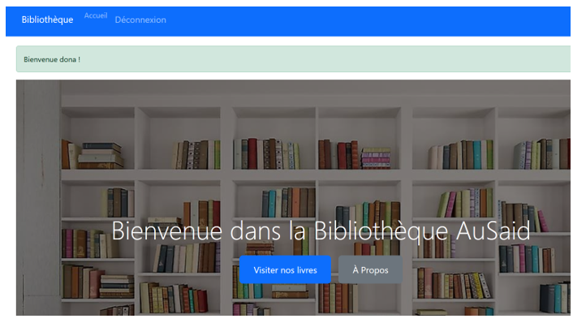

# 📚 Portfolio de Projets Académiques

## 🎯 Présentation

Ce repository contient une collection complète de projets académiques réalisés dans le cadre de formations en statistiques, économétrie, programmation et analyse de données. Chaque projet démontre des compétences spécifiques et des applications pratiques dans différents domaines.

## 📊 Projets Inclus

### 📈 Analyse Statistique
- **ANOVA** - Analyse de variance et double différence
- **R** - Analyse statistique et visualisation
- **SPSS** - Analyse statistique avancée
- **STATA** - Analyse économétrique et données PMA
- **Sondage** - Techniques d'échantillonnage

### 🏠 Économétrie
- **Économétrie des variables quantitatives** - Modélisation des prix immobiliers
- **Économétrie des variables qualitatives** - Modélisation des choix
- **Économétrie des séries temporelles** - Modélisation de la volatilité

### 🗺️ Analyse Spatiale
- **QGIS** - Analyse spatiale et cartographie

### 💻 Développement
- **bibliotheque** - Application Django de gestion de bibliothèque
- **Acces** - Base de données et VBA

### 📊 Business Intelligence
- **Excel-Tableau de Bord** - Tableaux de bord et BI

### 📱 Collecte de Données
- **CSPRO** - Application de collecte de données
- **Pratique d'enquête** - Méthodologie de recherche

### 📈 Analyse Spécialisée
- **TP d'analyse de Survie** - Analyse de survie

## 🛠️ Technologies Maîtrisées

### Langages de Programmation
- **R** : Analyse statistique, visualisation, modélisation
- **Python** : Django, analyse de données, Jupyter
- **VBA** : Automatisation Excel et Access
- **SQL** : Gestion de bases de données

### Logiciels Statistiques
- **SPSS** : Analyse statistique avancée
- **STATA** : Économétrie et analyse de données
- **QGIS** : Systèmes d'information géographique

### Outils de Collecte
- **CSPRO** : Collecte de données électroniques
- **ODK** : Open Data Kit
- **Excel** : Tableaux de bord et BI

### Documentation
- **LaTeX** : Rédaction académique
- **R Markdown** : Documents dynamiques
- **Quarto** : Publication scientifique

## 📸 Exemples Visuels

### Graphiques Statistiques

*Exemple de visualisation créée avec R*

### Tableaux de Bord

*Tableau de bord Excel avec Power Query*

### Cartes QGIS

*Analyse spatiale avec QGIS*

### Interface Django

*Interface de l'application bibliothèque*

## 🎯 Compétences Développées

### Statistiques et Économétrie
- **Tests statistiques** : ANOVA, régression, tests d'hypothèses
- **Modélisation** : Régression linéaire, logistique, séries temporelles
- **Échantillonnage** : Stratification, grappes, pondération
- **Analyse de survie** : Kaplan-Meier, modèles de Cox

### Programmation et Développement
- **Développement web** : Django, HTML, CSS, JavaScript
- **Bases de données** : SQL, Access, modélisation
- **Automatisation** : VBA, scripts R/Python
- **Visualisation** : ggplot2, matplotlib, QGIS

### Méthodologie de Recherche
- **Design d'enquêtes** : Conception de questionnaires
- **Collecte de données** : Terrain, électronique, validation
- **Analyse qualitative** : Entretiens, focus groups
- **Documentation** : Rapports, publications, présentations

## 📈 Applications Professionnelles

### Secteur Public
- **Instituts statistiques** : Recensements, enquêtes
- **Ministères** : Évaluation de politiques publiques
- **Organisations internationales** : ONU, Banque mondiale
- **Collectivités** : Planification territoriale

### Secteur Privé
- **Consulting** : Études de marché, évaluation
- **Finance** : Gestion des risques, modélisation
- **Industrie** : Contrôle qualité, optimisation
- **Services** : Satisfaction client, performance

### Recherche Académique
- **Universités** : Recherche, enseignement
- **Centres de recherche** : Projets de recherche
- **Publications** : Articles scientifiques, thèses
- **Conférences** : Présentations, communications

## 🚀 Améliorations Futures

### Technologies Émergentes
- **Machine Learning** : Modèles prédictifs avancés
- **Big Data** : Traitement de grands volumes
- **Cloud Computing** : Déploiement d'applications
- **API** : Intégration de données en temps réel

### Développement Personnel
- **Certifications** : SAS, Tableau, Power BI
- **Formations** : Cours en ligne, ateliers
- **Collaborations** : Projets internationaux
- **Publications** : Articles dans des revues

## 📚 Documentation

Chaque projet contient :
- **README détaillé** avec objectifs et méthodologie
- **Code source** commenté et documenté
- **Rapports** et présentations
- **Données** et résultats d'analyses

## 🤝 Contact

Pour plus d'informations sur ces projets ou pour des opportunités de collaboration :

- **Email** : [saidouyameogo3@gmail.com]
- **LinkedIn** : [votre-profil-linkedin]
- **GitHub** : [votre-profil-github]

---

*Ce portfolio démontre une expertise complète en analyse de données, statistiques et développement, avec des applications pratiques dans divers domaines professionnels.* 